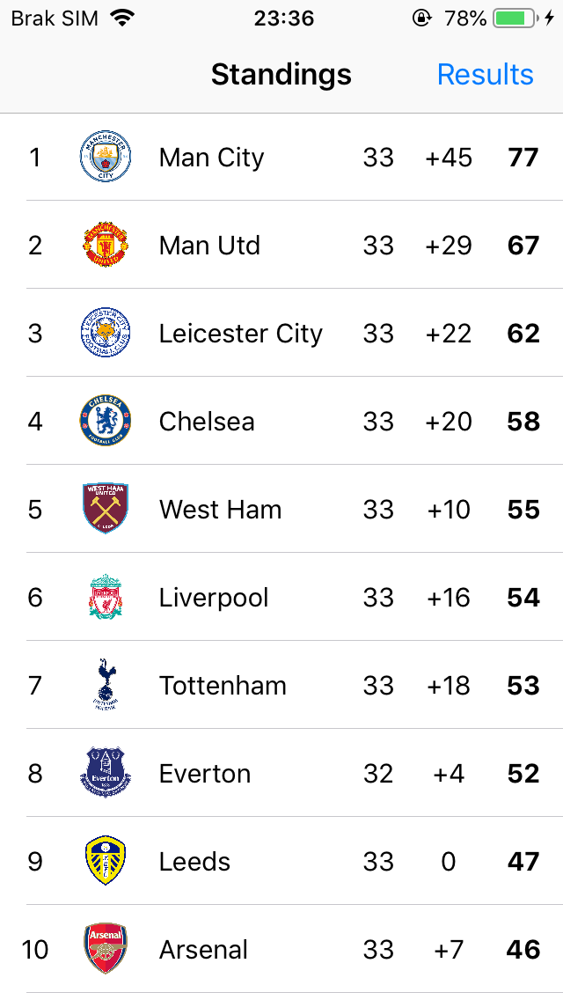
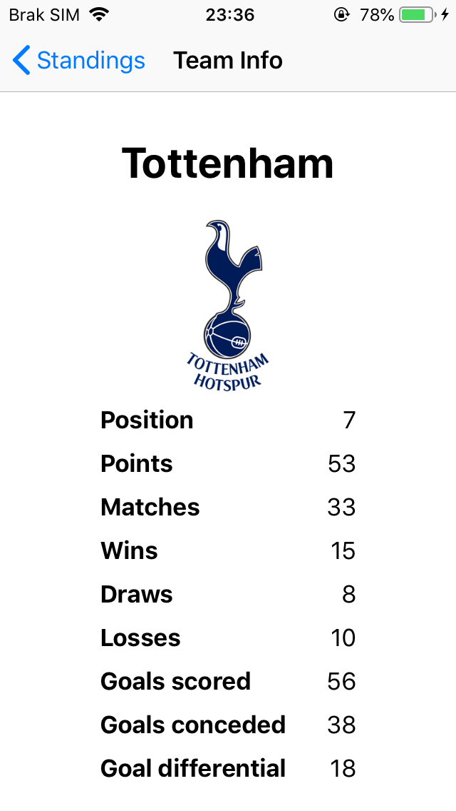
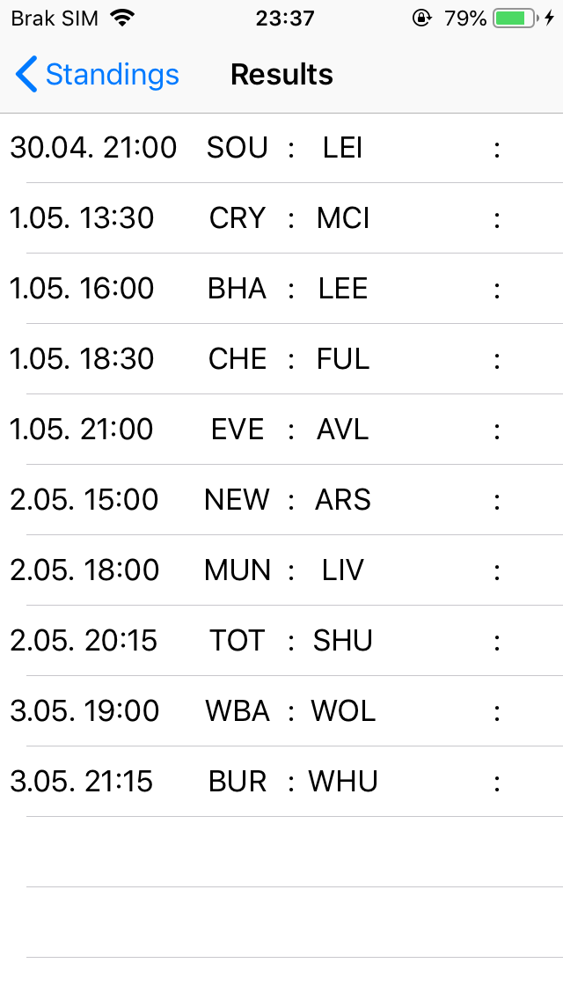
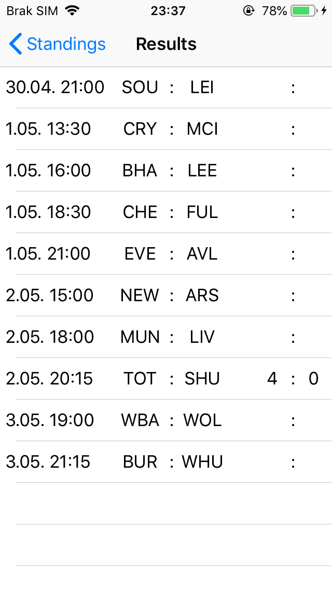
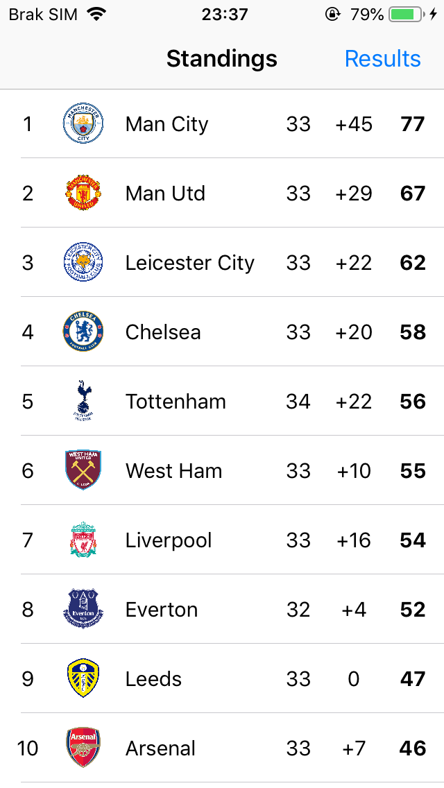

# PLStandings
App written in Swift using UIKit

Functionalities:
- getting data from prepared JSON
- displaying current Premier League table 
- displaying team info after tapping on them
- ability to enter results
- updating table

TODO:
 - saving the data to User Defaults
 - enable editing already entered results

